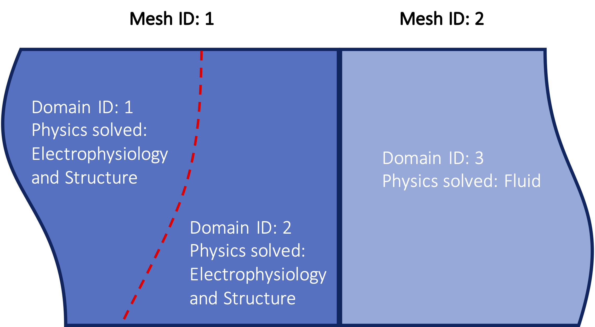
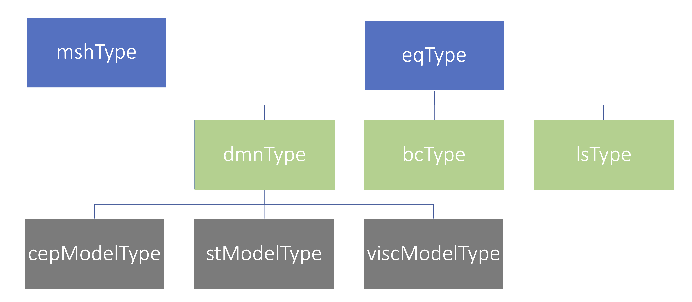

# Summary

Heart disease is the number one cause of death in the US [@Xu2020]. Many efforts have been devoted to studying its progression, diagnosis, and treatment. During the past decade, computational modeling has made significant inroads into the research of heart disease. The heart is inherently a multiphysics system that includes electrophysiology, tissue mechanics, and blood dynamics. Its normal function starts with the propagation of electrical signals that trigger the active contraction of the heart muscle to pump blood into the circulatory system. Rooted in fundamental laws of physics such as the balance of mass, momentum, and energy, computational modeling has been instrumental in studying cardiac physiology such as left ventricular function [@Mittal2015], cardiac arrhythmia [@Trayanova2011], and blood flow in the cardiovascular system [@Arzani2018;@Grande2021]. `svFSI` is the first open-source software that specializes in enabling coupled electro-mechano-hemodynamic simulations of the heart.

# Statement of need

Accompanying the growing popularity of studying cardiac physiology with computational modeling, many open-source software tools that specialize in modeling one or two aspects of the multiphysics process in the heart have been developed. For example, `SimVascular` [@Updegrove2017] enables patient-specific blood flow modeling by providing a complete pipeline from medical image segmentation to simulation results. `FEBio` [@Maas2012] specializes in modeling large-deformation structure mechanics in biophysics with fluid-structure interaction (FSI) capability as well. `openCARP` [@Vigmond2003] focuses on modeling cardiac electrophysiology. There are other general-purpose open-source software such as `LifeV` [@Bertagna2017] and `FEniCS` [@Logg2012], that can be flexibly adapted to simulate different physics in the heart, but significant development effort may be required for this purpose.

`svFSI` is a new multiphysics finite element solver designed specifically for computational modeling of integrative heart dynamics. As the next generation finite element solver for the `SimVascular` software, `svFSI` is capable of modeling hemodynamics, performing large-deformation FSI to capture the motion of cardiac chambers and their interaction with the blood flow, and simulating the complex excitation-contraction coupling between the intracellular ion-exchange processes and tissue contraction. To suit the diverse needs of users, our team has implemented non-Newtonian blood viscosity models, fiber-reinforced nonlinear hyperelastic material models, and both phenomenological and biophysics-based cellular activation models, as well as interfaces to multiple iterative linear solvers and preconditioners. `svFSI` is also capable of resolving the inherent multi-scale phenomena in cardiac physiology such as the interaction between Purkinje fibers and cardiac muscle, and setting up closed-loop multi-scale hemodynamic simulations with physiological boundary conditions. Moreover, it is worth emphasizing that `svFSI` is fully compatibility with `SimVascular`, and thus can take advantage of the existing pipeline for medical image segmentation, anatomic model construction, meshing, boundary condition prescription, etc. `svFSI` is written in Fortran, taking advantage of the object-oriented programming features of Fortran 2003. The code is highly modularized for ease of interoperability and extension. We acknowledge the limited open-source compiler support for Fortran on Windows systems, and there is an ongoing effort to convert `svFSI` into pure C++ software.

# Software architecture

{ width=80% }

The `svFSI` solver defines a modeling task through three key components (objects): mesh, domain, and equation. A mesh defines a spatial discretization of the physical regions such as the Purkinje network, myocardium, or the blood volume. It can be divided into non-overlapping domains through unique domain IDs. Different physical equations, such as the Navier-Stokes (fluid) equation and the structural mechanics (struct) equation are solved on each domain with domain-specific material properties. \autoref{fig:mesh} illustrates how these three objects are utilized in the multiphysics modeling of cardiac mechanics. The whole computational model is composed of two meshes. Mesh 1 represents the ventricular myocardium, where both electrophysiology and nonlinear solid mechanics equations are solved. Given the material heterogeneity of the myocardium, mesh 1 can be further divided into multiple domains so that domain-specific material properties, such as electrical conductivity and material elasticity, can be assigned. Mesh 2 is the fluid region where only the Navier-Stokes equations are solved.

{ width=80% }

This highly flexible, multi-mesh, and multi-domain modeling capability is realized in `svFSI` through the class hierarchy depicted in \autoref{fig:class}. The three key components, i.e. mesh, domain, and equation, correspond to classes mshType, dmnType and eqType, respectively. The material heterogeneity for electrophysiology, tissue mechanics or hemodynamics within each domain is defined through cepModelType, stModelType or viscModelType (see \autoref{tab:class}). Two other important classes, bcType and lsType, are also shown in \autoref{fig:class}. They define the boundary conditions and settings for the linear solver that are essential to generating a well-posed simulation configuration.

\begin{table}[H]
  \centering
  \begin{tabular}{|l|p{8cm}|}
  \hline
   \textbf{Class name} &  \textbf{Description}  \\ \hline
   mshType       &  Defines properties of the mesh, such as the element type, number of nodes per element, and coordinates. \\ \hline
   eqType        &  Defines properties of the equation, such as the physics (fluid/struct/electrophysiology), domains, linear solvers, and boundary conditions. \\ \hline
   dmnType       &  Defines properties of the domain, such as the physics (fluid/structure/electrophysiology), material properties, stabilization parameters, etc. \\ \hline
   bcType        &  Defines properties of the boundary conditions, such as Dirichlet or Neumann, time dependence, spatial profile, etc. \\ \hline
   lsType        &  Defines properties of linear solvers. \\ \hline
   cepModelType  &  Defines properties of the electrophysiology model \\ \hline
   stModelType   &  Defines properties of the structure material model \\ \hline
   viscModelType &  Defines properties of the viscosity model for fluids \\ \hline
  \end{tabular}
  \caption{Main classes defined in svFSI.}
  \label{tab:class}
\end{table}

Full documentation for `svFSI` functionality is available from the `SimVascular` website at http://simvascular.github.io.

# Conclusion
`svFSI` is a multiphysics finite-element solver focusing on whole heart modeling and consists of modules that can efficiently simulate hemodynamics, cardiac mechanics, cardiac electrophysiology as well as the multiphysical interactions among them. `svFSI` has been used to generate several publications [@Vedula2017;@Seo2020a;@Seo2020b;@Baumler2020;@Kong2020] and is employed in several active projects. We will continue to support and develop the software. New features such as methods to simulate heart valves, vascular growth and remodeling are currently under development. The software is envisioned to be applicable to a wide range of research questions in both pediatric and adult cardiovascular disease. 

# Acknowledgments

This work was supported by the National Science Foundation SI2-SSI 1663671 and 1663747. C.Z. also acknowledges funding from the American Heart Association award 20POST35200253. Previous contribution to the software by Dr. Mahdi Esmaily-Moghadam and Dr. Justin Tran is also acknowledged.

# References